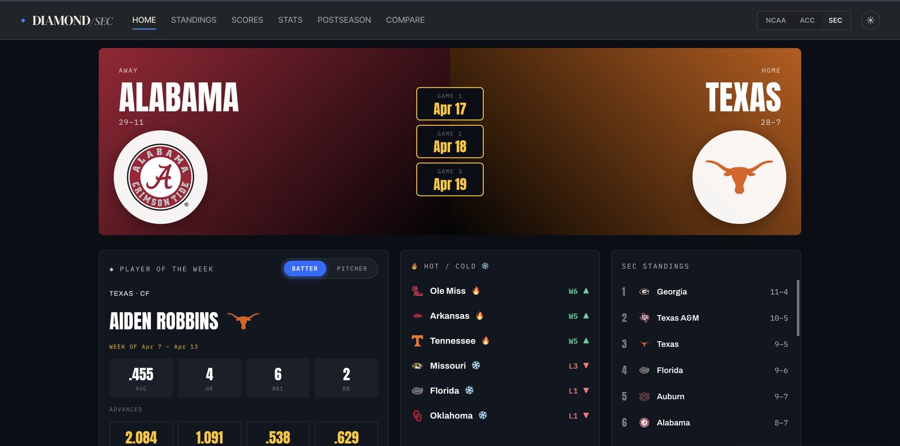
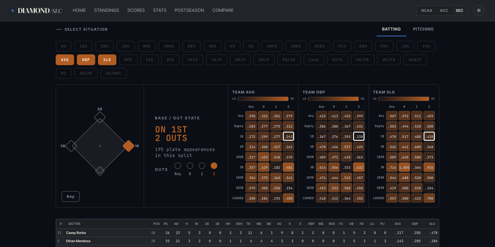

# ◆ Diamond — college baseball

**Live site: [collegebaseball.carsontech.ai](https://collegebaseball.carsontech.ai)**

A college-baseball site for the 2026 season: standings, scores, box scores, team and
player pages, stat leaders, head-to-head comparisons, and the full postseason —
conference tournaments → regionals → super regionals → College World Series → Finals.

It covers the **SEC** and **ACC** in depth (every game's box score and play-by-play),
plus the whole NCAA tournament field from the live bracket. A Flask backend serves a
single-page React frontend with no build step.



## Features

- **Home** that changes with the season: series and player of the week, conference
  leaders, and a stage page for each postseason round.
- **Standings** (conference and NCAA Top 25) with a rankings-over-time graph.
- **Scores** by day, and a **box score** for every game.
- **Team pages**: schedule, team and player stats, splits, and situational stats.
- **Player pages**: season totals and game-by-game logs.
- **Postseason**: the NCAA 64-team bracket and each conference tournament bracket.
- **Compare** two teams or two players.
- **View any date.** Open the date chip in the top bar, or add `?asof=YYYY-MM-DD` to
  any URL. The whole site, stats included, then shows the season as it stood that day,
  with no spoilers. No date means today.
- Light and dark themes.



## Engineering notes

**Two data sources, each used for what it's good at.** The henrygd API is fast and live
but incomplete: it has no per-team schedules and misses early non-conference box
scores. stats.ncaa.org has every game, but it sits behind bot protection that blocks
ordinary HTTP clients. So the scraper pulls stats.ncaa.org offline through a stealth
browser and saves each game to disk, and the app prefers that saved data and falls
back to the live API. `local_data.py` returns the same shapes as the API-backed
modules, so nothing downstream has to know which source answered.

**Caching in layers, from fastest to slowest:**

| Layer | What it holds |
|---|---|
| Browser | The bootstrap payload, plus team stats and box scores fetched on demand and kept in memory, so reopening a view makes no request. |
| Server memo | Responses kept in process with per-key lifetimes: 30 minutes for live data, 6 hours for season aggregates and team pages, 24 hours for some per-game data. A background thread warms the bootstrap payload at startup, so the first visitor after a deploy doesn't wait. |
| Precomputed files | Season totals, rosters and weekly records built offline, so a page reads totals instead of summing every game. |
| API response cache | Every upstream response saved to disk. Finished games and past days are kept forever because they can't change; today's games expire in 30 minutes; failed lookups are remembered for 6 hours so dead games aren't re-requested. Requests are throttled to the API's 5 per second. |

**Fixing a slowdown that only happened in production.** Building schedules cold opened
about 5,800 files across the SEC and ACC. That took about 2 seconds on a laptop but
tens of seconds on Azure, where the app's storage is a network share and every file
open is a round trip. A per-team `schedule_digest.json` caches the parts of each game
row that come from disk, cutting a cold build from about 180 file opens per team to
one. It rebuilds itself when the number of saved games changes, and live details like
rankings are still applied on every request so they stay current.

**Viewing the site as of any date.** `?asof=YYYY-MM-DD` is read per request, and every
date-aware piece of the app goes through one `clock.today()`. Every cache key that
depends on the date includes it, so two visitors looking at different dates never see
each other's results. When the date falls mid-season, stats are summed game by game
up to that day instead of read from the season totals.

## Quick start

Needs Python 3.12+.

```bash
python -m venv .venv
.venv/bin/pip install -r requirements.txt
.venv/bin/python app.py
```

Open <http://localhost:5050>. To view a past date, go to
<http://localhost:5050/?asof=2026-04-15>.

The season data in `Data/2026/` and the API cache in `cache/` are checked in, so the
site runs without pulling anything. The frontend is JSX that the browser transpiles at
runtime, so you edit a `.jsx` file and reload.

Set `DISABLE_PREWARM=1` to skip warming the bootstrap cache at startup.

## Where the data comes from

| Source | Used for | Notes |
|---|---|---|
| [henrygd NCAA API](https://github.com/henrygd/ncaa-api) (a JSON mirror of ncaa.com) | Team list, RPI, rankings, scoreboards, the live bracket, logos | Fast and live, but incomplete. Cached to `cache/`. |
| [stats.ncaa.org](https://stats.ncaa.org) | Per-game box scores and play-by-play for every game | Authoritative but behind bot protection, so it's reached with a stealth browser (Camoufox). Saved to `Data/2026/`. |

The app uses the saved stats.ncaa.org data when a game has been pulled and falls back
to the live API otherwise.

The game data in `Data/2026/` and `cache/` belongs to the NCAA. It's included only so
the site runs from a fresh clone, isn't covered by this repo's license, and isn't
meant to be redistributed.

## Refreshing the data

The scraping scripts use a separate virtualenv with heavier dependencies:

```bash
python -m venv .venv-dev
.venv-dev/bin/pip install -r requirements-dev.txt
.venv-dev/bin/python -m camoufox fetch     # one-time browser download
```

Then pull any missing games:

```bash
.venv/bin/python scripts/update.py              # every conference
.venv/bin/python scripts/update.py SEC          # one conference
.venv/bin/python scripts/update.py SEC Texas    # one team
```

`update.py` refreshes each team's schedule, pulls only the games not yet saved, and
switches itself into `.venv-dev`. It stops at the first blocked request; re-run it
later and it skips games it already has.

After pulling, rebuild the per-team summaries:

```bash
.venv-dev/bin/python scripts/build_stats.py     # stats/batting|pitching|fielding.json
.venv-dev/bin/python scripts/build_roster.py    # roster.txt
.venv-dev/bin/python scripts/build_records.py   # records.json (weekly W-L)
```

Each takes optional team names; with none, it runs for every team.

## Project layout

```
app.py               Flask app: /api/* endpoints + serves the SPA
clock.py             the effective "today" (per-request ?asof=)
season.py phase.py   schedules, team lists, where in the season we are
local_data.py        reads the saved Data/2026/ tree
stat_agg.py          sums per-game stats (used by the app and build_stats.py)
bracket.py           NCAA and conference tournament brackets
ncaa.py              cached henrygd API client
ncaa_stats.py        stats.ncaa.org client (Camoufox)
scripts/             the data pipeline
static/              index.html, bootstrap.js, *.jsx views, styles.css, logos/
Data/2026/<Conf>/<Team>/   saved season data
docs/                API reference, data shapes, decisions log
```

For more detail:

- [`docs/repo_description.md`](docs/repo_description.md): a file-by-file guide.
- [`docs/api.md`](docs/api.md): the `/api/*` endpoints.
- [`docs/data-shapes.md`](docs/data-shapes.md): the data formats.
- [`docs/decisions.md`](docs/decisions.md): why things are the way they are.

## Deployment

Pushing to `main` deploys to an Azure Web App through
[`.github/workflows/deploy.yml`](.github/workflows/deploy.yml). Production runs
gunicorn against `app:app`.

## How this was built

I designed the architecture and made the calls: the two-source data strategy, flat
JSON files instead of a database, the caching layers, and the hosting setup. Those
decisions are recorded with their reasoning in [`docs/decisions.md`](docs/decisions.md).

The implementation was built with Claude Code, using a team of specialist agents
(requirements, exploration, data, backend, frontend, QA and DevOps) coordinated
through [`CLAUDE.md`](CLAUDE.md). New screens such as the situational splits started
as prototypes in Claude Design, saved in `design/`, and were then rebuilt against the
real data in the app's own styling.
